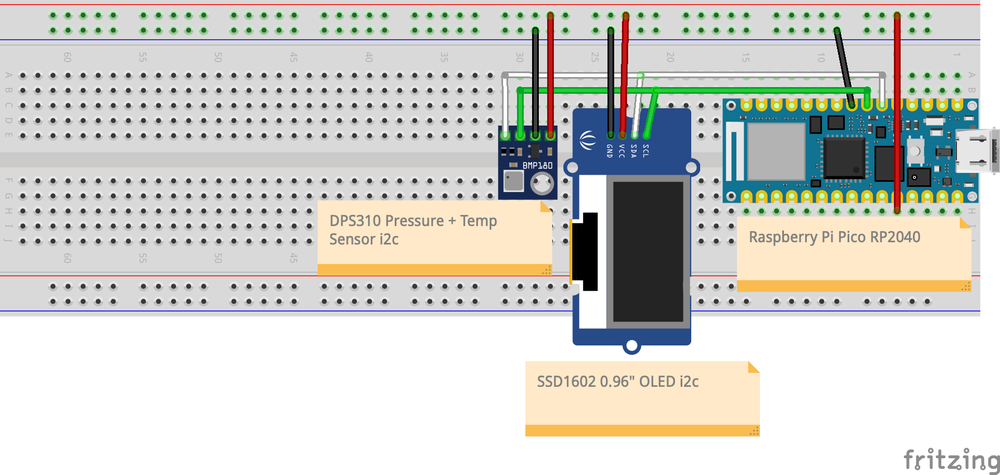

# Altimeter
> Author: Brian Tomlinson <darthlukan@gmail.com>

## Description

An altimeter implemented in C and meant to run on a Raspberry Pi Pico
microcontroller.

## Prototype Wiring

## License
GPLv3, see LICENSE file.
